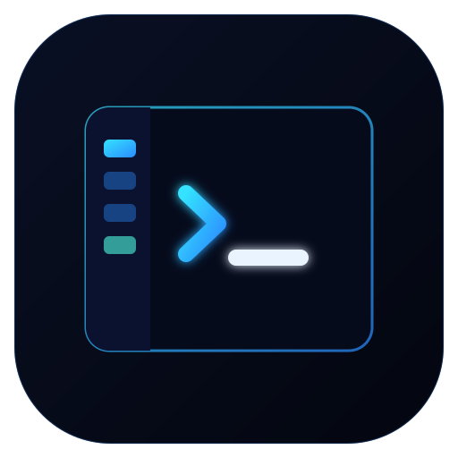

<p align="center">
  
</p>

<h1 align="center">TabDesk</h1>

<p align="center">
  A minimal Electron desktop shell for driving <a href="https://claude.com/claude-code">Claude Code</a>
  across many projects — a left tab rail of terminals, a grid view, and a live project preview.
</p>

---

## Fork notes (misty-moon)

Every agent and shell tab runs inside a named tmux session
(`td-<agent>-<project-path>`), so work survives TabDesk quitting, crashing, or
the X session restarting — the tabs come back at the next start and reattach,
scrollback and all. The × on a tab ends its session for real (that click is
the "I'm done" signal), and quitting the agent inside a tab ends it too. No
tmux command is ever required.

- **A project can have several tabs** — the `+` beside a picker row always
  opens another one, for a second agent or a second session of the same one.
  Extra tabs are numbered (`myproj ·2`) and carry their own session.
- **Worktrees** under `<project>/.worktrees/` appear indented under their
  project in the picker; searching a branch name finds them.
- **Finished tabs show how long they have waited**, so a rail of green dots
  can be worked oldest-first.
- Only one TabDesk runs at a time; `extras/tabdesk-autostart.desktop` starts
  `extras/tabdesk-guard.sh`, which brings it back after a crash.

Other deltas: in-app xterm.js terminals (no xterm/xdotool needed), Claude tabs
start with `--dangerously-skip-permissions`, symlinked projects show in the
rail and dot-dirs don't, Laravel previews run `php artisan serve`, and the
usage scan caches per file (`userData/usage-cache.json`). Launch with
`./tabdesk.sh` (points the rail at `/srv/dev`); `node scripts/seed-closed.js`
once pre-hides the non-project directories.

## Features

- **Project tab rail** — every directory under your projects folder becomes a tab, most-recently-modified first. Opening one spawns a terminal already running `claude --permission-mode auto` in that project.
- **Grid view** — cycle from 1 up to 6 panels visible at once (`▦ Grid`) to watch several agents work side by side.
- **Activity flags** — background tabs pulse while their terminal streams output and turn green when they fall quiet ("your turn").
- **Live preview dock** — runs the active project (static HTML, Node, Python/Flask/FastAPI/Django, Rust, Go, …), finds the port it binds, and renders it in a webview. Hover any element to reveal its source.
- **Follows your desktop** — colours are derived from the live GTK theme (light/dark, accent, borders) and the UI speaks your system language. Both update live when you change them in system settings.
- **Themes** — the original neon look is kept as a preset in `themes/neon.json`; drop in more JSON files to add your own.
- **Screenshot** — capture the focused terminal panel to a PNG in `~/Pictures`.
- **System bar** — live Claude Code token usage (daily / weekly / total with cost estimate), plus CPU, RAM, and a clock.
- **Fullscreen** — `F11` or the toolbar button.

## Requirements

- **Linux** (X11). Native terminal embedding uses `xterm` and `xdotool`; GTK colour probing uses `python3-gi` (all pulled in by the `.deb`).
- **Node.js** 18+ and a C toolchain (`node-pty` is compiled on install).

## Getting started

```bash
npm install      # also rebuilds node-pty against Electron
npm start
```

### Install as a desktop app

```bash
npm run dist                        # builds dist/tabdesk_<version>_amd64.deb
sudo apt install ./dist/tabdesk_0.1.0_amd64.deb
```

TabDesk then appears in the application menu under Development and launches
standalone from `/opt/TabDesk`.

## Configuration

Projects are read from `~/claude-projects` (`PROJECTS_DIR` in `main.js`).

### Theme and language

Both default to `system` and are stored in `~/.config/TabDesk/settings.json`:

```json
{ "theme": "system", "language": "system" }
```

- **`theme`** — `system` derives the palette from the running GTK theme (probed
  through `python3-gi`, falling back to a neutral light/dark pair) or the `id` of
  any preset in `themes/`, e.g. `neon`.
- **`language`** — `system` follows `LANGUAGE`/`LANG`, or a code with a file in
  `i18n/` (`en`, `sv`).

A theme file carries a small `palette` (the engine derives the rest), plus
optional `tokens` / `terminal` overrides — see `themes/neon.json`.

### Native terminal embedding

Terminals are embedded `xterm` windows reparented into the panels via X11
(`term-embed.js`), which is why `xterm` and `xdotool` are runtime dependencies.
Set `EMBED_NATIVE = false` in `renderer/renderer.js` to use in-app xterm.js
instead (screenshottable, but no native window).

## Project layout

| File | Role |
| --- | --- |
| `main.js` | Electron main process — window, IPC, terminal (pty) lifecycle |
| `preload.js` | Sandboxed bridge exposing `window.api` to the renderer |
| `renderer/` | UI (`index.html`, `renderer.js`, `styles.css`, `ui.js` theme/i18n layer) |
| `preview-runner.js` | Detects and launches a project for the live preview |
| `preview-preload.js` | Element inspector injected into the preview webview |
| `usage-worker.js` | Off-thread scan of `~/.claude/projects` for token usage |
| `term-embed.js` | Native `xterm` embedding via X11 reparenting |
| `theme.js` | Theme engine — GTK probe, token derivation, presets |
| `themes/` | Theme presets (`neon.json`) |
| `i18n.js`, `i18n/` | Translations and locale detection |
| `settings.js` | Persisted preferences in `userData/settings.json` |
| `build/` | App icon (`icon.svg` source, `icon.png` used at runtime) |

## License

[MIT](LICENSE) © Jonaz Thern
